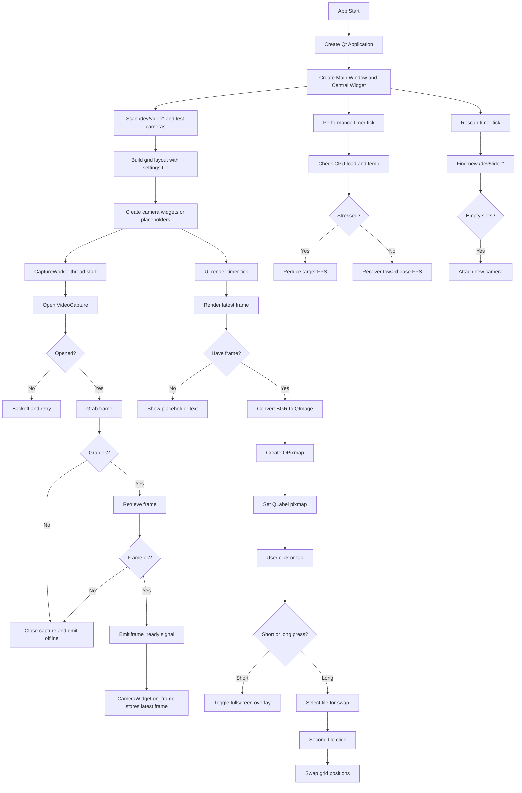

# Project Architecture Overview

```mermaid
flowchart TD
    A["App Start"] --> B["Create Qt Application"]
    B --> C["Create Main Window and Central Widget"]
    C --> D["Scan /dev/video* and test cameras"]
    D --> E["Build grid layout with settings tile"]
    E --> F["Create camera widgets or placeholders"]

    %% Capture thread lifecycle
    F --> G["CaptureWorker thread start"]
    G --> H["Open VideoCapture"]
    H --> I{"Opened?"}
    I -- No --> J["Backoff and retry"]
    I -- Yes --> K["Grab frame"]
    K --> L{"Grab ok?"}
    L -- No --> M["Close capture and emit offline"]
    L -- Yes --> N["Retrieve frame"]
    N --> O{"Frame ok?"}
    O -- No --> M
    O -- Yes --> P["Emit frame_ready signal"]

    %% Signal/slot path
    P --> Q["CameraWidget.on_frame stores latest frame"]

    %% UI render timer path
    F --> R["UI render timer tick"]
    R --> S["Render latest frame"]
    S --> T{"Have frame?"}
    T -- No --> U["Show placeholder text"]
    T -- Yes --> V["Convert BGR to QImage"]
    V --> W["Create QPixmap"]
    W --> X["Set QLabel pixmap"]

    %% Fullscreen overlay
    X --> Y["User click or tap"]
    Y --> Z{"Short or long press?"}
    Z -- Short --> AA["Toggle fullscreen overlay"]
    Z -- Long --> AB["Select tile for swap"]
    AB --> AC["Second tile click"]
    AC --> AD["Swap grid positions"]

    %% Dynamic FPS control
    C --> AE["Performance timer tick"]
    AE --> AF["Check CPU load and temp"]
    AF --> AG{"Stressed?"}
    AG -- Yes --> AH["Reduce target FPS"]
    AG -- No --> AI["Recover toward base FPS"]

    %% Hotplug rescan
    C --> AJ["Rescan timer tick"]
    AJ --> AK["Find new /dev/video*"]
    AK --> AL{"Empty slots?"}
    AL -- Yes --> AM["Attach new camera"]
```
